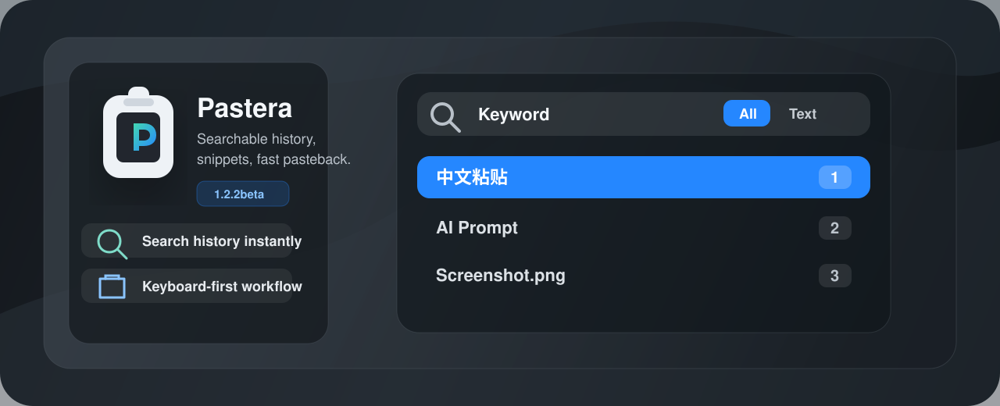

<p align="center">
  
</p>

<p align="center">
  <a href="https://github.com/AllenAlanEllenBarm/Pastera/releases/tag/v2.0.1-beta"><strong>Download 2.0.1-beta</strong></a>
  ·
  <a href="#latest-beta-201-beta">更新说明</a>
  ·
  <a href="#build">Build</a>
  ·
  <a href="#license">License</a>
</p>

# Pastera

Pastera is a refined macOS clipboard manager forked from
[Clipy](https://github.com/Clipy/Clipy). It keeps the lightweight menu-bar
workflow, then adds searchable history, snippet folders, image pasteboard
compatibility, a polished translucent interface, and a keyboard-first operating
model for fast pasteback.

## Highlights

- **Searchable history**: filter clipboard records quickly without leaving the
  compact history panel.
- **Snippet folders**: organize reusable prompts and text snippets with folder
  shortcuts and numeric item selection.
- **Image pasteboard support**: improves compatibility with screenshots from
  tools that use custom image pasteboard types.
- **Keyboard-first workflow**: navigate panels, settings, snippets, and history
  with shortcuts, arrows, Tab, and Return.
- **Native macOS feel**: lightweight menu-bar app, semantic colors, translucent
  surfaces, and no heavy background effects.

## Requirements

- macOS 13 Ventura or later
- Xcode 26.5 for local development

## Latest Beta: 2.0.1-beta

- 新增 OneDrive 本地文件夹同步：默认使用
  `~/Library/CloudStorage/OneDrive*/Pastera/sync`，自动同步默认关闭，也可手动立即同步。
- 同步协议简化为明文 JSON beta 格式，方便排查 OneDrive 冲突副本；旧加密同步记录会被跳过。
- 修正同步正确性：按更新时间做 LWW 导入、导入计数只统计实际写入，并在片段导出时补齐父文件夹上下文。
- 精简设置页：移除失效菜单项、同步口令和自定义同步目录，清空历史警告迁回通用页。
- 菜单选择默认直接粘贴，崩溃报告发送选项默认关闭，减少首次使用时的额外决策。
- 增加 DMG 发布脚本、GitHub Release workflow 和启动位置提示，降低从临时目录运行带来的权限问题。

## Build

The Xcode project, scheme, and source directory use lowercase `pastera`.
The built app product is `Pastera.app`.

```bash
xcodebuild CODE_SIGN_IDENTITY=- CODE_SIGNING_REQUIRED=NO CODE_SIGNING_ALLOWED=NO \
  -scheme pastera \
  -project pastera.xcodeproj \
  -clonedSourcePackagesDirPath "$PWD/.spm-cache/SourcePackages" \
  -packageCachePath "$PWD/.spm-cache/PackageCache" \
  -skipPackagePluginValidation \
  -skipMacroValidation \
  build
```

Local builds may use ad-hoc signing through
`Configurations/CodeSigning.xcconfig` because the upstream maintainer signing
certificates are not available for this fork.

## Local Install

For manual testing, build and replace the local app with:

```bash
./script/install_local.sh
```

The script installs to `/Applications/Pastera.app` by default and launches the
fresh build. Set `PASTERA_INSTALL_DIR="$HOME/Applications"` if `/Applications`
is not writable.

Codex local development also uses `.codex/hooks.json`: the Stop hook runs
`script/codex_stop_install_if_changed.sh`, which reinstalls only when
build-relevant app paths changed since the last local install.

## Upstream Attribution

Pastera is derived from Clipy and keeps the original MIT license terms. The
fork uses a different product name in line with the upstream distribution
request not to ship derived work as `Clipy` or `ClipMenu`.

## License

MIT. See `LICENSE` for details.
