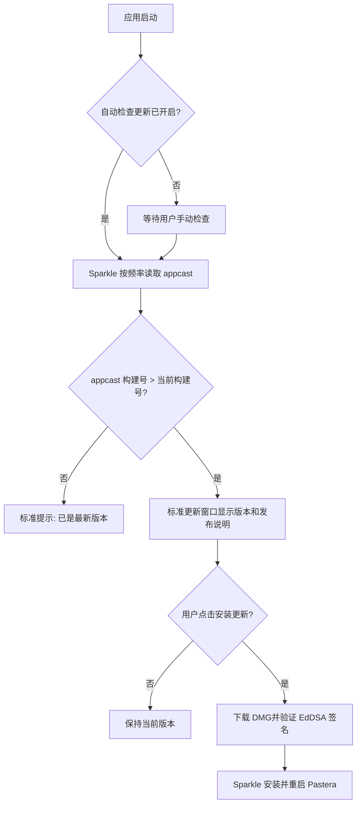

# Pastera 独立软件更新与可信自动更新实施计划

> **For agentic workers:** 实施时必须按任务顺序使用 `superpowers:executing-plans`、`superpowers:test-driven-development` 与 `coding-guardrails`；发布和交付收尾复用本计划并使用 `change-sync`。本文件是该需求的唯一实施计划，不回写历史计划。

**Goal:** 将“检查更新”从“偏好设置 > 关于 Pastera”独立为“软件更新”页面，默认开启定期检查；发现新版时继续使用 Sparkle 标准确认界面，由用户点击“安装更新”后自动下载、验签、安装并重启。同时修复当前 `3.0.0` 应用仍把 `1.2.2` 当作最新版本的版本元数据与 appcast 发布链路。

**Architecture:** AppKit 偏好设置新增独立 `.softwareUpdate` pane，更新页只通过一个可测试的 `PasteraUpdaterFacade` 操作现有 `SPUStandardUpdaterController`，不自建 GitHub 版本比较器和下载器。更新判断以构建产物中的数字型 `CFBundleVersion` 为机器比较依据，以数字型 `CFBundleShortVersionString` 为用户展示版本；`appcast.xml` 必须由 Sparkle `generate_appcast` 从已签名、已公证的 DMG 生成。定时检查只负责发现新版，安装始终由 Sparkle 标准 UI 请求用户确认，不静默下载或静默安装。

**Tech Stack:** Swift 6、AppKit、Combine、Sparkle 2.9.2、Swift Testing、Xcode 26.5、Bash、GitHub Actions

## Global Constraints

- 保持 macOS 13+、AppKit、Xcode Swift Package Manager 和现有 Sparkle 2.9.2 依赖，不新增更新框架或网络依赖。
- “自动更新”在本需求中的确定含义是：默认自动检查；发现更新后显示 Sparkle 标准更新窗口；用户点击确认后才自动下载、验签、安装并重启。
- 不新增“自动下载更新”开关，不设置 `automaticallyDownloadsUpdates = true`，不允许后台静默替换应用。
- 保留状态栏菜单现有“检查更新…”入口，仍直接调用同一个 `SPUStandardUpdaterController`。
- 不通过 GitHub Releases API 自行判断最新版，不实现自定义下载、挂载 DMG、替换 App 或重启逻辑。
- `CFBundleShortVersionString` 只使用点分数字营销版本，例如 `3.0.1`；`CFBundleVersion` 只使用单调递增数字构建号，例如 `301`。`beta` 只保留在 Git tag、Release 名称和 DMG 文件名中。
- appcast 的 `sparkle:version` 必须来自构建产物的 `CFBundleVersion`；`sparkle:shortVersionString` 必须来自构建产物的 `CFBundleShortVersionString`。
- 可执行更新只能发布带 EdDSA 签名的 enclosure；签名私钥的公钥必须与已安装应用 `Info.plist` 的 `SUPublicEDKey` 一致。
- 私钥、证书、密码和 notarization 凭据只从本机凭据文档、service account、Keychain 或 GitHub Actions secrets 读取，禁止写入仓库、计划、日志或聊天。
- 未恢复与现有 `SUPublicEDKey` 匹配的 Sparkle 私钥前，不发布伪签名或无签名的可执行更新，不以关闭验签规避问题。
- 保留现有用户未提交文件，特别是不触碰 `.codex/config.toml` 与 `.superpowers/`。
- 所有新增用户文案进入 `pastera/Resources/Localizable.xcstrings`，保持现有本地化语言条目完整。
- UI 沿用现有偏好设置的分组卡片、系统字体、SF Symbols、系统强调色、动态浅色/深色 token 与键盘/VoiceOver 结构，不引入网页式 hero、渐变或自定义弹窗。

---

## Business Scope / Out of Scope

### In Scope

- 在“服务与支持”侧边栏中按“同步 → 软件更新 → 关于 Pastera”排列三个页面。
- 新增“软件更新”页面，显示当前版本与构建号、立即检查、默认开启的自动检查、检查频率、上次检查时间和版本历史入口。
- “关于 Pastera”只保留应用身份、版本/构建、项目链接和许可证，不再持有 Sparkle 设置或检查逻辑。
- 抽离 Sparkle facade，使更新页可注入 fake updater 并稳定测试加载、禁用、检查中和重载订阅状态。
- 修复源 `Info.plist` 中带 `-beta` 的机器版本字段，建立数字型营销版本/构建号契约。
- 用 Sparkle `generate_appcast` 替代手工 Perl 字符串替换，从 DMG 内真实 bundle 元数据生成、签名和校验 appcast。
- 修复远端 feed，使当前客户端不再把 `1.2.2` 显示为最新版本，并完成一次从旧构建到新构建的用户确认更新验收。
- 为本机 UI、版本字段、appcast 生成、发布工作流和升级链路增加自动测试及人工验收记录。

### Out of Scope

- 不重做 Sparkle 的标准更新窗口、release notes 页面或安装进度 UI。
- 不增加自动下载、后台静默安装、强制更新、灰度发布、跳过版本管理或差分更新产品设置。
- 不迁移 appcast 托管平台，不新增更新服务器或数据库。
- 不 redesign “通用”“历史”“脚本”“快捷键”“排除的应用”“同步”等其他偏好页。
- 不在本任务中升级 Sparkle 依赖版本。
- 不把 Homebrew Cask 或 PKG 作为 Sparkle 更新载荷；Sparkle 继续使用 DMG。
- 不把任何私钥、Developer ID 证书或 Apple 账号材料纳入 Git 历史。

## Confirmed Product And Interaction Contract

### Sidebar and page structure

“服务与支持”固定为：

1. 同步（`icloud`）
2. 软件更新（`arrow.triangle.2.circlepath`）
3. 关于 Pastera（`info.circle`）

“软件更新”页面采用单列、三组卡片：

1. **当前版本**：应用图标、`Pastera 3.0.1`、`构建 301`、主操作“检查更新…”。
2. **自动检查**：复选框“自动检查更新”（默认开启）；开启时可选择每天、每周、每月，默认每天。
3. **更新记录**：上次检查时间与“查看版本历史”链接。

“关于 Pastera”保留：应用图标、版本/构建、GitHub 仓库/发布/问题链接、MIT License；不再出现自动检查、频率、检查按钮或更新状态。

### Interaction states

| State | UI behavior |
| --- | --- |
| 可检查 | “检查更新…”启用；自动检查和频率按当前设置可用 |
| 手动检查中 | 按钮禁用并显示“正在检查…”；阻止重复触发；Sparkle 完成状态变化后恢复 |
| 无新版 | 使用 Sparkle 标准“已是最新版本”反馈；页面更新“上次检查” |
| 有新版 | Sparkle 标准窗口显示版本与 release notes；用户点击“安装更新”后才下载、验签、安装、重启 |
| 用户取消/稍后 | 不下载、不安装；应用继续运行，自动检查设置不变 |
| 更新服务不可用 | 页面显示“暂时无法检查更新”，控件禁用；不暴露“Sparkle service”内部术语 |
| 自动检查关闭 | 频率选择禁用；“检查更新…”仍可手动使用 |

### Accessibility and responsive behavior

- 支持偏好窗口最小 `680×480` 与常用 `760×600` 尺寸；控件不得横向截断、重叠或滚出卡片。
- 交互目标至少 44pt；Tab 顺序为检查按钮 → 自动检查 → 频率 → 版本历史。
- VoiceOver label 描述操作语义，不重复内部 identifier；状态变化通过现有标准窗口和可访问状态文本表达。
- Reduce Motion 下不额外增加自定义加载动画；仅更新按钮标题和 enable state。
- 浅色/深色均使用系统 label、secondary label、link 和 accent 色，不硬编码 RGB。

## Runtime Flow



## File Map

- Create `pastera/Sources/Preferences/PasteraUpdaterFacade.swift`: 从 About 拆出的 updater 协议与 `SPUUpdater` 适配器。
- Create `pastera/Sources/Preferences/Panels/CPYSoftwareUpdatePreferenceViewController.swift`: 独立软件更新页的 UI、状态和操作。
- Modify `pastera/Sources/Preferences/Panels/CPYAboutPreferenceViewController.swift`: 删除 Sparkle/Combine/defaults 依赖和所有更新分组，只保留 About 内容。
- Modify `pastera/Sources/Preferences/PasteraPreferenceCatalog.swift`: 新增 `.softwareUpdate`、侧边栏项与搜索索引，迁移 `about.sparkle` 所属设置。
- Modify `pastera/Sources/Preferences/CPYPreferencesWindowController.swift`: 工厂注册新页面。
- Modify `pastera/Resources/Localizable.xcstrings`: 新页面、状态和可访问文案。
- Modify `pastera/Supporting Files/Info.plist`: 数字型营销版本、单调数字构建号，保留 feed URL 与现有公钥。
- Modify `script/package_release.sh`: 明确 release label 与 bundle 版本职责，并把 appcast 生成交给 artifact-driven 脚本。
- Modify `script/package_release_dmg.sh`: 构建后读取并验证 DMG 中 Pastera.app 的营销版本和构建号。
- Modify `script/update_appcast_for_dmg.sh`: 使用 Sparkle `generate_appcast` 生成并签名 feed，移除 Perl 直接改 XML。
- Create `script/verify_sparkle_ed_signature.swift`: 使用 bundle 内公开的 `SUPublicEDKey` 验证生成器写入的 DMG Ed25519 签名，不接触或输出私钥。
- Modify `.github/workflows/release-dmg.yml`: 在已上传签名公证 DMG 后生成 appcast，校验公钥、提交 feed 并回读远端。
- Modify `appcast.xml`: 由生成器写入首个正确的 3.x 发布项；禁止手工伪造签名。
- Modify `pastera.xcodeproj/project.pbxproj`: 注册两个新增 Swift 源文件与新增测试文件，保留现有文件顺序和用户改动。
- Modify `pasteraTests/AboutPreferenceTests.swift`: About 不再包含更新控件或 `about.sparkle` anchor。
- Create `pasteraTests/SoftwareUpdatePreferenceTests.swift`: 独立页的 bundle 元数据、默认值、状态和 updater 行为测试。
- Modify `pasteraTests/PreferenceSearchTests.swift`: 八个 pane 的顺序、分组、图标和搜索归属。
- Modify `pasteraTests/PreferenceWindowShellTests.swift`: 默认工厂、新页面缓存与搜索 reveal。
- Modify `pasteraTests/KeyboardAccessibilityTests.swift`: 新页面键盘/可访问性入口。
- Modify `pasteraTests/PreferencePaneAlignmentTests.swift`: 新页面 anchors 的窗口边界验证。
- Modify `pasteraTests/SparkleUpdateFeedTests.swift`: 数字版本契约、正确最新项、标准 Sparkle 路径和签名字段。
- Modify `pasteraTests/ReleasePackagingConfigurationTests.swift`: `generate_appcast`、公钥匹配门、artifact 元数据与工作流顺序。
- Modify `docs/verification/VERIFICATION.md`: 添加自动更新人工验收矩阵和证据记录位置。

## Interfaces And Data Contracts

### Updater facade

```swift
@MainActor
protocol PasteraUpdaterFacade: AnyObject {
    var automaticallyChecksForUpdates: Bool { get set }
    var updateCheckInterval: TimeInterval { get set }
    var lastUpdateCheckDate: Date? { get }
    var canCheckForUpdates: Bool { get }
    var stateChanges: AnyPublisher<Void, Never> { get }

    func checkForUpdates()
}
```

该协议不得增加下载、安装或重启方法。安装行为继续由 `SPUStandardUpdaterController` 的标准 user driver 负责；页面只发起检查并观察可检查状态/上次检查时间。

### Stable identifiers

```text
pane: softwareUpdate
anchors:
  softwareUpdate.currentVersion
  softwareUpdate.automaticCheck
  softwareUpdate.lastCheck
controls:
  softwareUpdate.applicationIcon
  softwareUpdate.checkNow
  softwareUpdate.automaticChecks
  softwareUpdate.checkInterval
  softwareUpdate.lastCheckValue
  softwareUpdate.releasesLink
  softwareUpdate.status
```

旧 `about.sparkle` 不做别名保留：它是尚未对外形成自动化契约的内部 anchor；搜索目录和测试一次性迁移到 `softwareUpdate.*`，避免一个设置同时属于两个页面。

### Version contract

```text
Git tag / release label: v3.0.1-beta
DMG filename:           Pastera-3.0.1-beta-macOS.dmg
CFBundleShortVersion:   3.0.1
CFBundleVersion:        301
sparkle:shortVersion:   3.0.1
sparkle:version:        301
```

后续 beta 依次使用新的营销版本和更大的构建号；不得把 `3.0.1-beta` 写入任何 bundle 版本字段。首个修复发布使用 `v3.0.1-beta / 3.0.1 / 301`，不移动或覆盖已发布的 `v3.0.0-beta` tag。

## Acceptance Mapping

| ID | Requirement | Automated evidence | Manual / remote evidence |
| --- | --- | --- | --- |
| A1 | 更新功能成为独立页面 | catalog、window shell、search、alignment 测试 | 侧边栏截图显示“同步 → 软件更新 → 关于” |
| A2 | About 不再持有更新设置 | `AboutPreferenceTests` 断言无更新控件/anchor | About 页面截图 |
| A3 | 自动检查默认开启 | `SoftwareUpdatePreferenceTests` + `CPYUtilities` 默认值断言 | 新 UserDefaults suite 首次打开为开启 |
| A4 | 关闭自动检查后仍可手动检查 | fake updater 行为测试 | 本机点击检查能显示标准 Sparkle 反馈 |
| A5 | 发现更新后由用户确认安装 | 不存在 auto-download API 的源代码测试 | 低版本安装 → 标准窗口 → 点击安装 → 重启 |
| A6 | 当前版本不再显示 1.2.2 为最新 | appcast 首项版本/构建号测试 | 打开远端 raw feed，3.x 项排在首位；3.0.0 客户端检查结果正确 |
| A7 | 机器版本可可靠比较 | bundle 数字版本测试 | `mdls`/`defaults read` 回读已构建 App 为 `3.0.1 / 301` |
| A8 | 更新载荷可验签 | appcast enclosure signature 与公钥匹配门测试 | Sparkle 完成下载、验签、安装和重启 |
| A9 | appcast 不再手工改 XML | packaging 测试断言使用 `generate_appcast` 且无 Perl 替换 | workflow 日志和远端 appcast commit |
| A10 | UI 可访问且适配窗口 | keyboard、alignment、light/dark 结构测试 | `680×480`、`760×600`、浅/深色、Reduce Motion 截图 |
| A11 | 发布链路可追溯 | workflow 顺序测试 | tag→commit、release asset digest、feed commit、远端 raw 内容回读 |

证据档位：`standard + release-critical`。UI/业务用 focused + full regression；签名、公证、远端 feed 和真实自更新不能由单元测试替代，必须保留发布资产及远端回读证据。

---

## Tasks

### Task 1: 用失败测试锁定独立页面和用户确认式更新契约

**Files:**
- Create: `pasteraTests/SoftwareUpdatePreferenceTests.swift`
- Modify: `pasteraTests/AboutPreferenceTests.swift`
- Modify: `pasteraTests/PreferenceSearchTests.swift`
- Modify: `pasteraTests/PreferenceWindowShellTests.swift`
- Modify: `pasteraTests/KeyboardAccessibilityTests.swift`
- Modify: `pasteraTests/PreferencePaneAlignmentTests.swift`
- Modify: `pasteraTests/SparkleUpdateFeedTests.swift`
- Modify: `pastera.xcodeproj/project.pbxproj`

**Interfaces:**
- Consumes: 现有 `Constants.Update.enableAutomaticCheck`、`Constants.Update.checkInterval`
- Produces: `.softwareUpdate` pane、`softwareUpdate.*` anchor/control 测试契约

- [ ] **Step 1: 将 About 测试收窄到 About 业务**

  从 `AboutPreferenceTests` 删除 fake updater、自动检查、频率、检查中和 unavailable 测试。保留版本、图标、GitHub、license 测试，并新增以下否定断言：

  ```swift
  #expect(!controller.revealSetting(anchorID: "about.sparkle", animated: false))
  #expect(view(in: controller.view, identifier: "softwareUpdate.checkNow") == nil)
  #expect(view(in: controller.view, identifier: "softwareUpdate.automaticChecks") == nil)
  ```

- [ ] **Step 2: 新建更新页测试套件**

  `SoftwareUpdatePreferenceTests` 至少覆盖：

  - 注入 bundle 后显示营销版本和构建号，paneID 为 `.softwareUpdate`。
  - 全新 suite 注册默认值后，“自动检查更新”为 on、频率为 daily，并立即同步 live updater。
  - 用户关闭自动检查时写入 defaults、更新 updater、禁用频率，但手动检查按钮仍启用。
  - 点击“检查更新…”只调用一次 `checkForUpdates()`；检查中按钮禁用并显示“正在检查…”。
  - updater 状态恢复后按钮恢复，last check date 刷新。
  - updater 不存在时显示“暂时无法检查更新”，所有 updater-dependent 控件禁用。
  - controller 重载两次只保留一份订阅和一组控件。
  - 点击“查看版本历史”只打开 `https://github.com/pastera-app/Pastera/releases`。
  - 源码中不存在 `automaticallyDownloadsUpdates`、自定义下载/安装器和 GitHub Releases API fallback。

- [ ] **Step 3: 修改偏好设置结构测试的期望**

  将 pane 顺序固定为：

  ```swift
  [.general, .history, .scripts, .shortcuts, .excludedApps, .sync, .softwareUpdate, .about]
  ```

  对应 raw value、标题、图标、groupTitle 和缓存数由 7 改为 8；默认工厂要求 `.softwareUpdate` 返回 `CPYSoftwareUpdatePreferenceViewController`。将 `about.sparkle` 搜索项替换为 `softwareUpdate.checkNow`、`softwareUpdate.automaticCheck` 和 `softwareUpdate.lastCheck`。

- [ ] **Step 4: 更新 Sparkle 路径测试**

  `manualUpdateCheckUsesSparkleWithoutGitHubDownloadFallback` 改为读取 `CPYSoftwareUpdatePreferenceViewController.swift`，断言只调用 facade 的 `checkForUpdates()`；About 源码不得 import Sparkle 或包含 update controls。

- [ ] **Step 5: 运行 focused tests 并确认 RED**

  ```bash
  xcodebuild CODE_SIGN_IDENTITY=- CODE_SIGNING_REQUIRED=NO CODE_SIGNING_ALLOWED=NO \
    -scheme pastera \
    -project pastera.xcodeproj \
    -clonedSourcePackagesDirPath "$PWD/.spm-cache/SourcePackages" \
    -packageCachePath "$PWD/.spm-cache/PackageCache" \
    -skipPackagePluginValidation \
    -skipMacroValidation \
    test \
    -only-testing:pasteraTests/AboutPreferenceTests \
    -only-testing:pasteraTests/SoftwareUpdatePreferenceTests \
    -only-testing:pasteraTests/PreferenceSearchTests \
    -only-testing:pasteraTests/PreferenceWindowShellTests \
    -only-testing:pasteraTests/KeyboardAccessibilityTests \
    -only-testing:pasteraTests/PreferencePaneAlignmentTests \
    -only-testing:pasteraTests/SparkleUpdateFeedTests
  ```

  Expected: 因 `.softwareUpdate`、新 controller 和新 identifiers 尚不存在而编译/测试失败；不得先改 production code 使其跳过 RED。

### Task 2: 抽离 updater facade、实现软件更新页并精简 About

**Files:**
- Create: `pastera/Sources/Preferences/PasteraUpdaterFacade.swift`
- Create: `pastera/Sources/Preferences/Panels/CPYSoftwareUpdatePreferenceViewController.swift`
- Modify: `pastera/Sources/Preferences/Panels/CPYAboutPreferenceViewController.swift`
- Modify: `pastera/Resources/Localizable.xcstrings`
- Modify: `pastera.xcodeproj/project.pbxproj`

**Interfaces:**
- Consumes: `SPUUpdater`、AppDelegate 的 `updaterController`、既有 update defaults
- Produces: 可注入 `PasteraUpdaterFacade`、独立更新页及稳定 accessibility identifiers

- [ ] **Step 1: 移动 facade，不改变运行语义**

  将 `PasteraUpdaterFacade` 与 `PasteraSparkleUpdaterFacade` 从 About 文件移到独立文件。适配器继续将 `lastUpdateCheckDate` 和 `canCheckForUpdates` KVO 合并为 `stateChanges`；不得增加下载或安装方法。

- [ ] **Step 2: 建立更新页依赖和生命周期**

  `CPYSoftwareUpdatePreferenceViewController` 初始化签名固定为：

  ```swift
  init(
      bundle: Bundle = .main,
      defaults: UserDefaults = AppEnvironment.current.defaults,
      updaterProvider: @escaping @MainActor () -> (any PasteraUpdaterFacade)? = { /* AppDelegate adapter */ },
      applicationIconProvider: @escaping (Bundle) -> NSImage = { /* existing provider */ },
      openURL: @escaping (URL) -> Void = { _ = NSWorkspace.shared.open($0) }
  )
  ```

  `loadView()` 每次先取消旧 Combine 订阅、清空 updater 和 controls，再创建三组卡片并连接 updater，避免重复订阅和重复 subviews。

- [ ] **Step 3: 实现三组原生 AppKit 内容**

  - 当前版本：72pt 应用图标、版本、构建号、rounded 主按钮。
  - 自动检查：checkbox + daily/weekly/monthly pop-up；沿用 `86_400 / 604_800 / 2_592_000`。
  - 更新记录：格式化上次检查日期，未检查显示“从未检查”；版本历史使用 semantic link button。
  - group icon 使用 `app.badge`、`clock.arrow.2.circlepath`、`clock` 或当前 macOS 13 可用等价 SF Symbol；若 symbol 不可用必须回退到已有可用 symbol，不能显示空白。

- [ ] **Step 4: 实现状态机，不接管 Sparkle 弹窗**

  页面内部仅维护 `manualCheckInFlight`：点击检查后设为 true、禁用按钮并切换标题；观察到 `lastUpdateCheckDate` 变化或 `canCheckForUpdates` 恢复后清除。`updater == nil` 使用普通警告状态“暂时无法检查更新”。

  自动检查 checkbox 的处理顺序固定为：写 defaults → 写 `updater.automaticallyChecksForUpdates` → 刷新频率 enabled state。关闭自动检查不得禁用 `checkNowButton`。

- [ ] **Step 5: 精简 About**

  删除 About 中的 `Combine`/`Sparkle` imports、update interval、updater/defaults provider、所有更新控件和 `buildUpdatesGroup()`。About 初始化只保留 bundle、icon provider 和 openURL；加载后只创建 Application、Project Links、License 三组。

- [ ] **Step 6: 补齐本地化和 accessibility 文案**

  至少新增/确认：Software Update、Current Version、Check for Updates…、Checking…、Automatically Check for Updates、Check Frequency、Last Check、Never Checked、Temporarily Unable to Check for Updates、View Release History。各现有 locale 不得留下空字符串。

- [ ] **Step 7: 注册新增源文件并运行页面测试**

  使用 Xcode project 现有 PBX group 风格加入两个源文件和测试文件，不重排整个 `project.pbxproj`。重新运行 Task 1 命令；此时页面级测试仍可因 catalog 尚未注册而失败，但 `AboutPreferenceTests` 与 `SoftwareUpdatePreferenceTests` 应通过。

### Task 3: 注册第八个 pane、迁移搜索归属并完成 UI 回归

**Files:**
- Modify: `pastera/Sources/Preferences/PasteraPreferenceCatalog.swift`
- Modify: `pastera/Sources/Preferences/CPYPreferencesWindowController.swift`
- Modify: `pasteraTests/PreferenceSearchTests.swift`
- Modify: `pasteraTests/PreferenceWindowShellTests.swift`
- Modify: `pasteraTests/KeyboardAccessibilityTests.swift`
- Modify: `pasteraTests/PreferencePaneAlignmentTests.swift`

- [ ] **Step 1: 注册 enum、目录项和工厂**

  在 `.sync` 与 `.about` 之间加入 `.softwareUpdate`。catalog title 为“软件更新”/“Software Update”，symbol 为 `arrow.triangle.2.circlepath`，group 为“服务与支持”。window factory 返回 `CPYSoftwareUpdatePreferenceViewController()`。

- [ ] **Step 2: 建立独立搜索项**

  新页面 search items 固定为：

  ```text
  softwareUpdate.checkNow       -> softwareUpdate.currentVersion
  softwareUpdate.automaticCheck -> softwareUpdate.automaticCheck
  softwareUpdate.lastCheck      -> softwareUpdate.lastCheck
  ```

  keywords 同时覆盖 `update`、`software update`、`check for updates`、`automatic update`、`更新`、`检查更新`。About 删除 `about.sparkle`。

- [ ] **Step 3: 验证布局、搜索、键盘和 Reduce Motion**

  alignment anchors 改为：

  ```swift
  (.softwareUpdate, [
      "softwareUpdate.currentVersion",
      "softwareUpdate.automaticCheck",
      "softwareUpdate.lastCheck"
  ])
  ```

  window shell 断言缓存数为 8；搜索点击“自动检查更新”后选中 `.softwareUpdate` 并 reveal 精确 anchor；键盘测试确认第八页可通过侧边栏和搜索进入。

- [ ] **Step 4: 运行 Task 1 focused tests 并确认 GREEN**

  Expected: 所列更新页、About、catalog、shell、keyboard、alignment、Sparkle 路径测试全部通过。

- [ ] **Step 5: 记录真实 UI 证据**

  本机安装前先在测试宿主或 Debug app 中截取：

  - `680×480` 浅色软件更新页；
  - `760×600` 深色软件更新页；
  - 自动检查关闭且手动检查仍启用；
  - 检查中；
  - About 已无更新分组。

  对照视觉契约检查卡片边界、标题基线、图标、按钮 target、截断、滚动、VoiceOver label 和 Reduce Motion。

### Task 4: 修正数字版本字段并锁定构建产物版本契约

**Files:**
- Modify: `pastera/Supporting Files/Info.plist`
- Modify: `script/package_release_dmg.sh`
- Modify: `pasteraTests/SparkleUpdateFeedTests.swift`
- Modify: `pasteraTests/ReleasePackagingConfigurationTests.swift`

- [ ] **Step 1: 先写版本契约失败测试**

  新增测试要求：

  ```swift
  #expect(shortVersion == "3.0.1")
  #expect(shortVersion.wholeMatch(of: /[0-9]+(?:\.[0-9]+){2}/) != nil)
  #expect(build == "301")
  #expect(build.wholeMatch(of: /[0-9]+(?:\.[0-9]+){0,2}/) != nil)
  #expect(!shortVersion.localizedCaseInsensitiveContains("beta"))
  #expect(!build.localizedCaseInsensitiveContains("beta"))
  ```

  packaging 测试要求脚本从构建后的 `.app/Contents/Info.plist` 读取两个字段，验证 release label 去掉 prerelease suffix 后与营销版本一致，并拒绝非数字构建号。

- [ ] **Step 2: 运行版本/打包 focused tests 并确认 RED**

  ```bash
  xcodebuild CODE_SIGN_IDENTITY=- CODE_SIGNING_REQUIRED=NO CODE_SIGNING_ALLOWED=NO \
    -scheme pastera \
    -project pastera.xcodeproj \
    -clonedSourcePackagesDirPath "$PWD/.spm-cache/SourcePackages" \
    -packageCachePath "$PWD/.spm-cache/PackageCache" \
    -skipPackagePluginValidation \
    -skipMacroValidation \
    test \
    -only-testing:pasteraTests/SparkleUpdateFeedTests \
    -only-testing:pasteraTests/ReleasePackagingConfigurationTests
  ```

  Expected: 当前 `3.0.0-beta / 3.0.0-beta` 不符合契约而失败。

- [ ] **Step 3: 设置首个修复发布版本**

  将源 bundle metadata 更新为：

  ```xml
  <key>CFBundleShortVersionString</key>
  <string>3.0.1</string>
  <key>CFBundleVersion</key>
  <string>301</string>
  ```

  `SUFeedURL` 与 `SUPublicEDKey` 此步骤保持原值；不得为了通过测试替换公钥。

- [ ] **Step 4: 在打包后读取真实 App metadata**

  `package_release_dmg.sh` 完成 build 后，从产物 `Pastera.app/Contents/Info.plist` 读取 `bundle_short_version` 与 `bundle_build_version`：

  - `VERSION=3.0.1-beta` 仅控制 DMG 文件名和 GitHub release label；
  - `${VERSION%%-*}` 必须等于 `bundle_short_version`；
  - `bundle_build_version` 必须满足数字/点分数字格式；
  - 验证失败必须在签名、公证和上传之前退出。

- [ ] **Step 5: 验证构建产物**

  ```bash
  xcodebuild CODE_SIGN_IDENTITY=- CODE_SIGNING_REQUIRED=NO CODE_SIGNING_ALLOWED=NO \
    -scheme pastera \
    -project pastera.xcodeproj \
    -configuration Release \
    -clonedSourcePackagesDirPath "$PWD/.spm-cache/SourcePackages" \
    -packageCachePath "$PWD/.spm-cache/PackageCache" \
    -skipPackagePluginValidation \
    -skipMacroValidation \
    -derivedDataPath "$PWD/.build/update-release-derived-data" \
    build

  /usr/libexec/PlistBuddy -c 'Print :CFBundleShortVersionString' \
    .build/update-release-derived-data/Build/Products/Release/Pastera.app/Contents/Info.plist
  /usr/libexec/PlistBuddy -c 'Print :CFBundleVersion' \
    .build/update-release-derived-data/Build/Products/Release/Pastera.app/Contents/Info.plist
  ```

  Expected: 依次输出 `3.0.1` 和 `301`。

### Task 5: 用 Sparkle generate_appcast 重建可信发布链路

**Files:**
- Modify: `script/update_appcast_for_dmg.sh`
- Modify: `script/package_release.sh`
- Create: `script/verify_sparkle_ed_signature.swift`
- Modify: `.github/workflows/release-dmg.yml`
- Modify: `pasteraTests/ReleasePackagingConfigurationTests.swift`
- Modify: `pasteraTests/SparkleUpdateFeedTests.swift`

**Interfaces:**
- Consumes: 签名、公证后的 DMG；`SPARKLE_PRIVATE_KEY` via stdin；tag/release label
- Produces: generator-created `appcast.xml` with signed enclosure and artifact-derived versions

- [ ] **Step 1: 先写生成器与密钥门测试**

  测试要求 `update_appcast_for_dmg.sh`：

  - 定位 `generate_appcast`，不再调用 `sign_update` 后用 Perl 改 XML；
  - 通过 `--ed-key-file -` 从 stdin 读取 secret；
  - 使用 `--download-url-prefix`、`--link`、`--versions` 与临时 staging directory；
  - 生成后解析 XML，断言 `sparkle:version` 等于 DMG 内 bundle build、short version 等于 bundle marketing version、URL/length/type/signature 非空；
  - 调用 `verify_sparkle_ed_signature.swift`，用 DMG 内 `SUPublicEDKey` 对 DMG 字节和生成的 `sparkle:edSignature` 做 Ed25519 校验；key 不匹配时失败；
  - 临时目录通过 `mktemp -d` 创建并由 trap 删除，日志不输出私钥；
  - 签名与 `Info.plist` `SUPublicEDKey` 不匹配时，在改写 appcast 前失败。

- [ ] **Step 2: 运行 packaging focused tests 并确认 RED**

  使用 Task 4 的 focused command。Expected: 当前脚本仍包含 `sign_update` 和 Perl 替换，因此失败。

- [ ] **Step 3: 改为 artifact-driven 生成**

  新脚本接口固定为：

  ```text
  script/update_appcast_for_dmg.sh --tag TAG --dmg PATH
  ```

  实现顺序：

  1. 验证 DMG 存在、tag 非空、`SPARKLE_PRIVATE_KEY` 非空。
  2. 定位 Sparkle `generate_appcast`，从 DMG 内读取公开的 `SUPublicEDKey`。
  3. 挂载/检查 DMG 内 Pastera.app，读取 marketing/build，不使用 CLI version 填 XML。
  4. 创建 staging dir，复制现有 `appcast.xml` 与 DMG。
  5. 执行：

     ```bash
     printf '%s' "$SPARKLE_PRIVATE_KEY" | "$SPARKLE_GENERATE_APPCAST_BIN" \
       --ed-key-file - \
       --download-url-prefix "https://github.com/pastera-app/Pastera/releases/download/${TAG}/" \
       --link "https://github.com/pastera-app/Pastera/releases/tag/${TAG}" \
       --versions "$BUNDLE_BUILD_VERSION" \
       --maximum-versions 3 \
       "$STAGE_DIR"
     ```

  6. 解析 staging appcast，校验首个目标 item 的版本、URL、length、`application/x-apple-diskimage`。
  7. 使用 `verify_sparkle_ed_signature.swift` 与 bundle `SUPublicEDKey` 验证目标 DMG 的 Ed25519 signature；只输出 match/mismatch，不输出 key。
  8. 所有校验通过后才用原子替换写回目标 `appcast.xml`。

- [ ] **Step 4: 调整 package entrypoint 和 Actions workflow**

  `package_release.sh` 不再向 appcast 脚本传 `--version`。workflow 保持“构建签名公证 DMG → 上传 release asset → 生成 appcast → commit/push feed”的顺序；生成前新增 secrets 非空检查和公钥匹配检查，生成后 `git diff -- appcast.xml` 只能显示 feed 元数据，不得包含 secret。

- [ ] **Step 5: 用无敏感信息的 fixture 验证脚本结构**

  自动测试只验证脚本结构、XML 解析和失败路径。真实签名测试留给 Task 6 的安全凭据门，不在仓库创建 fake 私钥替换生产公钥。

- [ ] **Step 6: 重新运行 focused tests 并确认 GREEN**

  `SparkleUpdateFeedTests` 与 `ReleasePackagingConfigurationTests` 全部通过；`git diff --check` 无格式问题。

### Task 6: 恢复信任链、发布首个修复版本并修正远端 feed

**Files:**
- Modify: `appcast.xml`（仅由 `generate_appcast` 生成）
- Modify: `docs/verification/VERIFICATION.md`
- External: local Keychain / GitHub Actions secrets / GitHub Release `v3.0.1-beta`

**Hard gate:** 已验证当前机器默认 Sparkle key 的公钥与应用内 `SUPublicEDKey` 不一致。实施者必须先完成以下只读核查；没有匹配私钥时不得进入“可执行自动更新发布”步骤。

- [ ] **Step 1: 安全核查现有签名材料**

  按仓库凭据规则查询 `~/.codex/docs/local-credentials.md`、`~/.codex/service-accounts.toml`、对应 Keychain 项和 GitHub Actions secret 名称。比较时只记录：source、found/not found、public-key match true/false；不得打印或记录 private material。

  同时确认 Developer ID Application、notary profile 和 GitHub release 权限可用。任何一项缺失都将发布状态记为 blocked，不降低签名/公证要求。

- [ ] **Step 2A: 若恢复到匹配现有 SUPublicEDKey 的私钥，完成直接自动更新发布**

  1. 将匹配私钥安全注入 `SPARKLE_PRIVATE_KEY`，补齐 GitHub Actions secrets；不写入文件。
  2. 在实现提交上创建新 tag `v3.0.1-beta`，不得移动 `v3.0.0-beta`。
  3. 通过 workflow 构建、Developer ID 签名、公证 `Pastera-3.0.1-beta-macOS.dmg`。
  4. 上传 asset 后运行 `generate_appcast`，将 `301 / 3.0.1` 项发布到 `develop/appcast.xml`。
  5. 从远端 raw URL 回读 appcast，确认 3.x 目标项排在旧 `1.2.2` 之前且 enclosure 可下载、length 与 asset 一致、signature 非空。
  6. 在保留旧 `3.0.0-beta` 的测试机上点击“检查更新…”，看到 `3.0.1` 标准窗口；点击“安装更新”后验签、安装、重启，并回读 App 为 `3.0.1 / 301`。

- [ ] **Step 2B: 若无法恢复匹配私钥，执行一次性人工桥接，不伪装为自动更新完成**

  1. 暂停 executable enclosure 发布，明确记录“现有 3.0.0 安装无法信任新 key”。
  2. 在安全 Keychain/CI 中创建 Pastera 专用新 EdDSA key，将新公钥嵌入 `v3.0.1-beta` bundle，并把私钥只存 Keychain/Actions secret。
  3. 对旧客户端发布由 Sparkle 支持的 informational update 项，指向 `v3.0.1-beta` Release 页面；该项不包含伪造的可执行签名，用户需手动下载安装一次。
  4. 手动桥接版安装后，从下一构建开始使用新 key 发布 signed enclosure；以隔离测试 feed 验证 `3.0.1 / 301` 能通过用户确认自动更新到更高数字构建。
  5. 在 Delivery Record 中将“现有 3.0.0 直接自动更新”标记为受旧 key 丢失限制；只有用户完成桥接后，才能把长期自动更新能力标为 complete。

- [ ] **Step 3: 修复 1.2.2 错误结果并回读远端**

  无论走 2A 还是 2B，远端 feed 的最新可见 item 都必须是 3.x，不能继续以 `1.2.2beta` 作为首个/最新项。验证：

  ```bash
  curl -fsSL https://raw.githubusercontent.com/pastera-app/Pastera/develop/appcast.xml
  gh release view v3.0.1-beta --repo pastera-app/Pastera --json tagName,targetCommitish,assets
  git ls-remote origin refs/heads/develop refs/tags/v3.0.1-beta
  ```

  保存 tag→commit、asset name/size/digest、feed commit 和 appcast target item 的非敏感证据。

### Task 7: 全量回归、本地安装和交付记录

**Files:**
- Modify: `docs/verification/VERIFICATION.md`
- Modify: 本计划 `Delivery Record`

- [ ] **Step 1: 运行完整 Debug regression**

  ```bash
  xcodebuild CODE_SIGN_IDENTITY=- CODE_SIGNING_REQUIRED=NO CODE_SIGNING_ALLOWED=NO \
    -scheme pastera \
    -project pastera.xcodeproj \
    -clonedSourcePackagesDirPath "$PWD/.spm-cache/SourcePackages" \
    -packageCachePath "$PWD/.spm-cache/PackageCache" \
    -skipPackagePluginValidation \
    -skipMacroValidation \
    clean test
  ```

- [ ] **Step 2: 运行 Release build 和静态检查**

  ```bash
  xcodebuild CODE_SIGN_IDENTITY=- CODE_SIGNING_REQUIRED=NO CODE_SIGNING_ALLOWED=NO \
    -scheme pastera \
    -project pastera.xcodeproj \
    -configuration Release \
    -clonedSourcePackagesDirPath "$PWD/.spm-cache/SourcePackages" \
    -packageCachePath "$PWD/.spm-cache/PackageCache" \
    -skipPackagePluginValidation \
    -skipMacroValidation \
    build

  git diff --check
  ```

- [ ] **Step 3: 本地安装并验证运行态**

  ```bash
  ./script/install_local.sh
  pgrep -fl '/Applications/Pastera.app/Contents/MacOS/Pastera'
  /usr/libexec/PlistBuddy -c 'Print :CFBundleShortVersionString' /Applications/Pastera.app/Contents/Info.plist
  /usr/libexec/PlistBuddy -c 'Print :CFBundleVersion' /Applications/Pastera.app/Contents/Info.plist
  ```

  手工验证：侧边栏顺序、About 精简、默认自动检查、关闭后手动检查、检查中状态、版本历史链接、标准“已是最新版本”反馈。

- [ ] **Step 4: 执行真实更新验收**

  在隔离用户账户/测试机保留旧 App 和独立 defaults：

  - 自动检查开启时能在到期后弹出标准更新窗口；
  - 手动检查能立即弹出相同窗口；
  - 未点击安装前无下载/替换；
  - 点击安装后完成下载、验签、退出、替换、重启；
  - 重启后版本/构建正确，用户设置和历史数据保留；
  - 签名损坏或 key 不匹配的 fixture 被拒绝安装。

- [ ] **Step 5: 更新唯一 Delivery Record**

  在本计划记录实现 commit、测试数量、Release build、安装路径、截图路径、签名/公证结果、tag、release asset digest、feed commit 和远端回读。若走人工桥接分支，清楚区分“UI/发布链路已完成”和“旧 3.0.0 直接自动更新受 key 限制”。

---

## Risks, Rollback And Observation

| Risk | Prevention / observation | Rollback |
| --- | --- | --- |
| 现有 Sparkle 私钥丢失 | 发布前只比较公钥；真实旧版验签测试 | 不发布 executable enclosure，改走一次性人工桥接 |
| 数字构建号不递增导致不提示 | 构建和 appcast 测试比较 `sparkle:version`；远端回读 | 撤回错误 feed commit，保留正确旧 item，发布更大构建号 |
| appcast 指向错误/未上传资产 | workflow 强制 upload 在 generate 前；HEAD/size/digest 回读 | revert feed commit，不删除已发布可用旧资产 |
| 用户误以为会静默更新 | UI 仅写“自动检查更新”；无自动下载开关 | 恢复到仅手动检查 defaults，不改安装器 |
| 手动检查按钮被错误禁用 | 测试覆盖自动检查 off + manual enabled | 回滚页面状态变更，保留 facade 抽离 |
| About 或搜索入口回归 | 八页 catalog、factory、search、alignment 全覆盖 | 单独 revert catalog/page routing commit |
| `project.pbxproj` 冲突 | 只增加指定 fileRef/buildFile，不重排 | 手工移除新增引用，保留用户其他 project 改动 |
| 新版安装后无法启动 | 签名、公证、Gatekeeper、Release build、测试机升级 | 撤回 appcast 新 item；GitHub release 标记 prerelease/说明；发布更高构建修复，绝不降低版本号 |

运行观察只记录非敏感信息：检查时间、目标版本/构建、Sparkle 标准错误类别、下载/验签/安装结果、重启后版本。不得记录私钥、证书密码或 Apple 凭据。

## Delivery Metadata

- Plan path: `docs/superpowers/plans/2026-07-20-pastera-software-update.md`
- Plan status: `confirmed-product-contract / implementation-pending`
- User confirmation: 自动检查选项默认开启；检测到更新后，用户点击确认再自动更新。
- Evidence level: `standard + release-critical`
- ZenTao Story/Task: 未同步；本需求当前没有用户提供的 taskID，也未要求归档到禅道。
- OpenSpec/taskID spec: 不适用；本计划是当前唯一实施与验收入口。
- Historical plan boundary: `2026-07-10-pastera-preferences-center.md` 只记录当时把 Sparkle 控件放入 About 的历史决策，不回写。

## Delivery Record

### Actual Implementation

- Implementation commit: `94e7389 feat(update): 独立软件更新并升级至 3.0.1`.
- 新增独立 `.softwareUpdate` pane 和 `PasteraUpdaterFacade`；About 页不再承担 Sparkle 设置与检查逻辑。
- 自动检查默认开启，关闭后仍可手动检查；发现更新后继续由 Sparkle 标准 UI 请求用户确认安装。
- Bundle 版本升级为 `3.0.1 (301)`；DMG/appcast 脚本改为从产物真实元数据生成并校验 Ed25519 签名。
- GitHub Release workflow 新增 Sparkle 私钥非空门禁，不再使用 Perl 手工改写 appcast 版本字段。

### Plan Deviations

- 实施期间分支已新增 `.agentIntegrations` pane，因此偏好设置实际为 9 页，不是计划初始写的 8 页；“同步 → 软件更新 → 关于”相对顺序保持不变。
- 并行完整回归首次出现 2 个 Vault Agent 时序超时；失败套件单独复跑 57 项通过，单 worker 完整回归 908 项通过，未为此修改业务代码。
- Release 验证使用 scheme `archive` 而非应用 `-target` 直接构建；直接 target 路径因 PINCache/PINOperation 生成 module map 缺失失败，archive 的完整依赖图成功。
- 未修改 `appcast.xml` 或 `docs/verification/VERIFICATION.md`，未生成 UI 截图；这些属于尚未完成的发布/人工验收证据。

### Impact

- 触达 AppKit 偏好设置路由、Sparkle 启动/检查设置、bundle 版本、本地化、DMG 打包脚本和 GitHub Release workflow。
- 不新增自定义下载器、安装器、GitHub Releases API 版本比较或静默更新行为。
- 未改变数据库、用户历史或密码箱数据契约。

### Verification

- Focused: 更新相关 8 个套件、85 项测试通过。
- Full Debug: 单 worker 完整回归 86 个套件、908 项测试通过。
- Release: arm64 Release Archive 成功，归档内 Pastera.app 回读为 `3.0.1 (301)`。
- Local install: `./script/install_local.sh` 成功；`/Applications/Pastera.app` 为 `3.0.1 (301)` 并已运行。
- Static: `git diff --check`、Shell 语法、Info.plist、本地化 JSON 和 Swift Ed25519 验证器检查通过。

### Remaining Risks

- 本机未找到与应用 `SUPublicEDKey` 匹配的 Sparkle 私钥，也没有 Developer ID Application 证书和可用公证 profile。
- 仓库当前 `appcast.xml` 仍是 `1.2.2beta`；在合法签名、公证和远程 feed 发布前，已发布旧客户端仍不能完成 3.x 可执行自动更新。
- 未完成旧构建 → 新构建的真实 Sparkle 下载、验签、安装和重启验收。

### Follow-ups

- 恢复匹配的 Sparkle 私钥或按 Task 6 执行一次性人工桥接。
- 准备 Developer ID/公证凭据后发布 `v3.0.1-beta` DMG，由 `generate_appcast` 更新 feed，再完成远程和旧版客户端回读。
- 补齐软件更新页的浅色/深色、最小窗口、关闭自动检查和检查中状态人工证据。

### ZenTao Closeout

- 未执行；用户明确要求跳过禅道确认，本需求也没有已回读的 storyID/taskID/bugID。

### Final Delivery Status

- 代码实现、自动测试、Release Archive 和本地安装已完成。
- 签名/公证 DMG、Git tag/GitHub Release、远程 appcast 与真实旧版自更新仍被发布凭据门禁阻断，不得标记为已完成。
